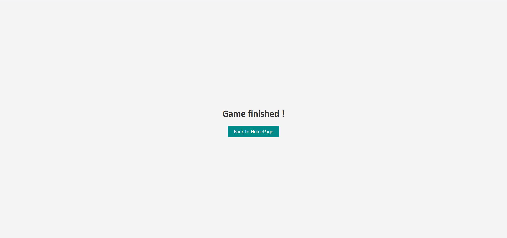

## Group Project Repository

## Group members
Our group consists of me & Romain

## Introduction
This project is all about a battleship naval game, where the computer place the boats on a 10x10 grid, and where the user has to fond and sink all the ships.

## Start and access the project
In order to setup the game and start a game, you **must** start **both** the `battleships_client` and the `battleships_server`. After doing that, you acces the game on a browser at:
```
http://localhost:8081/
```
\
Then, click on the button in order to start the game.\


## How to play the game
Once you have started a game, you have access to a 10x10 grid. Click on any case to try to hit a ship.\


## CHEATING ( :o )
You can access both the server terminal and the client terminal to see what the program is up to. On the client side, you will see some requests from the server and the responses, and from the server side, some logic we printed in the terminal + the grid where the ships are placed!

\


## Winning condition
Once every ship is sunk (20 ships hit), you finished the game!
At the end, the game generates a `.txt` file with the number of hits you took to sink all ships.\
\
\

